# 大作业设计

设计文档
* 前言
* 业务描述
* 数据库设计（ER图）
* 应用系统模块设计、以及功能点描述
* 系统实现描述
* 总结
* 参考文献和资料


## 前言

本作业旨在完成一个图书管理系统，从而实践学习到的数据库知识。

图书管理系统的模式参考学校的图书馆借阅流程


## 业务描述

业务目标是实现一个学校的图书馆管理系统，作为学校的图书馆管理系统，包含两个部分：

* 学生/老师：作为借阅者，可以登录、操作（借阅还书等）、注销
* 管理者：
  * 学生管理：通过管理系统，管理借阅者的情况，处理学生的借阅问题
  * 图书馆员工：通过管理系统，添加、修改、下架图书
  * 超级管理：查看其它管理者操作记录

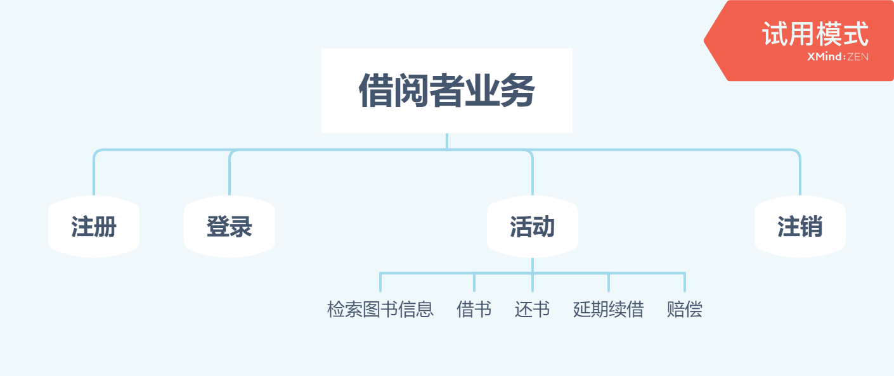

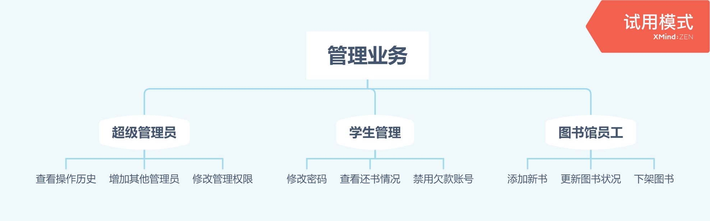


## 数据库设计（ER图）

### ER图

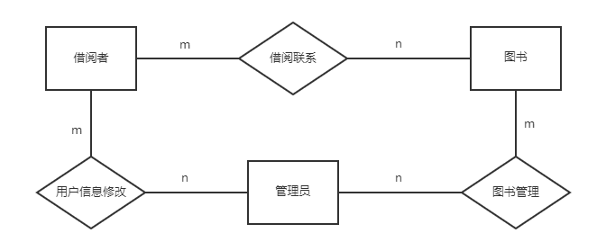


### 解释

包含3个实体和3个联系：

* 实体：
  * 借阅者：id（学生教师号）、姓名、密码、用户类型、在借书数目、备注、是否被禁用
  * 图书：id（书号）、书名、简介、类型、作者、出版社、价格、数量、备注、是否下架
  * 管理员：id（账号）、密码、权限类型、备注
* 联系：
  * 借阅联系：借出时间、借阅期限、归还时间、状态、备注
  * 用户信息修改：修改日期、修改类型、备注
  * 图书管理：操作日期、操作类型、操作数值、原始数值、最终数值、备注


### 转换为关系模型

| 借阅者UserList | 学生/教师号       | 姓名         | 密码                | 用户类型   | 在借书数量   | 备注     | 是否已经被禁用 |
| -------------- | ----------------- | ------------ | ------------------- | ---------- | ------------ | -------- | -------------- |
| 字段名         | Uno               | Uname        | Upassword           | Utype      | Uget         | more     | Urestrict      |
| 字段类型       | char              | nvarchar     | char                | nvarchar   | int          | nvarchar | bit            |
| 限制           | 主键，11位        | 非空，最长10 | 32                  | 最长10     | 非负，非空   | 2000     | 非空           |
| 备注           | 如S/T/U2018201661 | 真名字       | 初始化学号；MD5加密 | 有限的几种 | 业务检查即可 | 初始为空 | 0代表否        |


| 图书Book | 书号       | 书名          | 简介     | 类型     | 作者     | 出版社   | 价格     | 剩余数量 | 备注     | 是否下架 |
| -------- | ---------- | ------------- | -------- | -------- | -------- | -------- | -------- | -------- | -------- | -------- |
| 字段名   | Bno        | Bname         | breif    | Btype    | author   | Press    | price    | num      | more     | removed  |
| 字段类型 | char       | nvarcahr      | nvarchar | nvarchar | nvarchar | nvarchar | numeric  | 整数     | nvarchar | bit      |
| 限制     | 主键，13位 | 100以内，非空 | 1000以内 | 最长20   | 最长100  | 最长100  | 两位小数 | 非负     | 2000以内 | 非空     |
| 备注     | ISBN号     | 含副标题      |          |          |          |          | 人民币   |          | 初始为空 | 0代表否  |


| 管理员AdminList | 账号         | 密码      | 权限类型         | 备注     |
| --------------- | ------------ | --------- | ---------------- | -------- |
| 字段名          | Ano          | Apassword | Atype            | more     |
| 字段类型        | char         | char      | nvarchar         | nvarcahr |
| 限制            | 主键，20以内 | 32        | 最长10           | 2000以内 |
| 备注            |              | MD5加密   | 不同权限不同效果 |          |


| 借阅联系Borrow | 借书人 | 被借书 | 借出时间 | 借阅期限 | 归还时间 | 状态 | 备注 |
| -------------- | -------- | -------- | -------- | ---- | ---- | ---- | ---- |
| 字段名 | Uno | Bno | outDate | maxtime | returnDate | isReturn | more |
| 字段类型 | char | char | date | int | date | bit | nvarchar |
| 限制 | 11 | 13 |          | 非负 | 归还晚于借出 | 非空 | 2000 |
| 备注 | 外键 | 外键 |          |      |      | 是否归还 |      |

利用借书人+书+借出日期构成联合主键，因为同一个人可以借同一个书多次，但是一天内不能重复借（如果用时间戳更加严谨，但此处进行简化）


| 用户信息修改UAlter | 用户 | 管理者 | 修改时间 | 修改类型  | 备注     |
| ------------------ | ---- | ------ | -------- | --------- | -------- |
| 字段名             | Uno  | Ano    | actDate  | AlterType | more     |
| 字段类型           | char | char   | date     | nvarchar  | nvarchar |
| 限制               | 11   | 20     |          | 非空，20  | 2000     |
| 备注               | 外键 | 外键   |          |           |          |

用户信息修改类型有：创建、改密码、禁用、解禁

采用用户+管理者+修改时间作为联合主键


| 图书管理BAlter | 图书 | 管理者 | 操作时间 | 操作类型  | 操作数值 | 原始数值 | 最终数值 | 备注     |
| -------------- | ---- | ------ | -------- | --------- | -------- | -------- | -------- | -------- |
| 字段名         | Bno  | Ano    | actDate  | AlterType | act      | old      | new      | more     |
| 字段类型       | char | char   | date     | nvarchar  | int      | int      | int      | nvarchar |
| 限制           | 13   | 20     |          | 非空，20  |          |          |          | 2000     |
| 备注           | 外键 | 外键   |          |           |          |          |          |          |

图书的操作类型有：入库、损失、出库

采用图书+管理者+操作时间作为联合主键


## 应用系统模块设计、功能点描述

功能整体分为两块：读者的操作（借书还书等）、管理员的操作（查看/修改-图书/借阅数据）

读者操作：

* 注册
* 借阅操作（此处操作认为在网页点击即可借还）：
  * 借书
  * 还书
  * 续借
* 注销

管理操作：

* 信息查阅：
  * 显示当前库内图书的信息
* 图书管理
  * 购入
  * 下架


### 读者功能-登录

登录是读者端的基本功能，在用户的入口`user`网页中，有三种情况：

* 新用户进入网页：显示为一个登录输入账号密码的框
* 登录成功：显示登录成功
* 登录有误：显示登录有误，再次显示登录框


### 读者功能-退出登录

在登录后，点击退出登录按钮即可退出登录


### 读者功能-校外注册

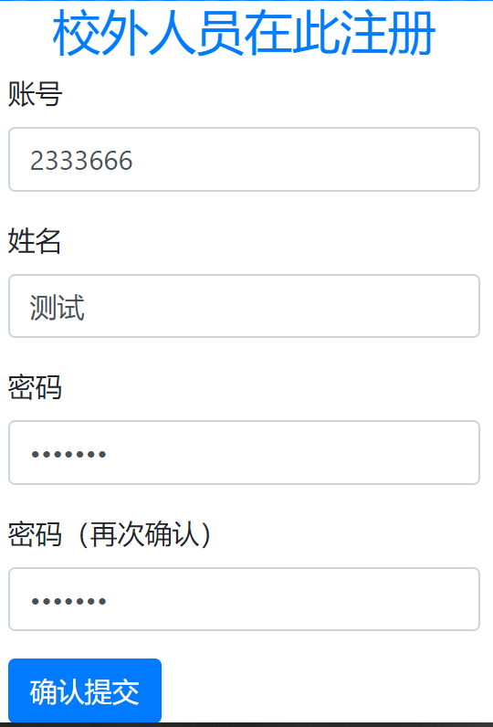


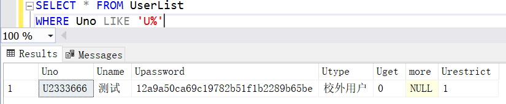

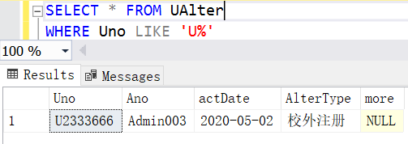

### 读者功能-图书信息查询


## 系统描述实现

### python环境

使用的是venv虚拟环境，python为3.7版本

继承了原本环境的包，同时在虚拟环境添加了

```
pip freeze > requirements.txt
```

安装的依赖以及使用这个方法导出到文件中，可以直接用

```
pip install -r requirements/requirements.txt
```

来安装到自己的电脑中（但是建议别全安装，因为里面有一些是和项目无关的库，比如jupyter）

本环境安装了`flask-bootstrap`，但是在实际使用中采用的是boostrap的本地CSS而不是flask模板（由于boostrap4是适应移动端的，所以电脑观察体验不是特别好）

### 数据库配置

```mssql
CREATE TABLE UserList
(
    Uno char(11) PRIMARY KEY,
    Uname nvarchar(10) NOT NULL,
    Upassword char(32) NOT NULL,
    Utype nvarchar(10) NOT NULL,
    Uget int NOT NULL,
    more nvarchar(2000),
    Urestrict bit NOT NULL,
)
```

```mssql
CREATE TABLE Book(
    Bno char(13) PRIMARY KEY,
    Bname nvarchar(100) NOT NULL,
    brief nvarchar(1000) NOT NULL,
    Btype nvarchar(20),
    author nvarchar(100) NOT NULL,
    Press nvarchar(100) NOT NULL,
    price numeric(5,2) NOT NULL,
    num int,
    more nvarchar(2000),
    removed bit NOT NULL
)
```

```mssql
CREATE TABLE AdminList(
    Ano char(20) PRIMARY KEY,
    Apassword char(32) NOT NULL,
	Atype nvarchar(10) NOT NULL,
	more nvarchar(2000)
)
```

```mssql
CREATE TABLE Borrow(
    Uno char(11),
    Bno char(13),
    outDate date NOT NULL,
    maxtime int NOT NULL,
    returnDate date,
    isReturn bit NOT NULL,
    more nvarchar(2000),
    FOREIGN KEY (Uno) REFERENCES UserList(Uno) 
    ON DELETE CASCADE
    ON UPDATE CASCADE,
    FOREIGN KEY (Bno) REFERENCES Book(Bno) 
    ON DELETE CASCADE
    ON UPDATE CASCADE,
	PRIMARY KEY (Uno,Bno,outDate)
)
```

```mssql
CREATE TABLE UAlter(
    Uno char(11),
    Ano char(20),
	actDate date NOT NULL,
	AlterType nvarchar(20) NOT NULL,
	more nvarchar(2000),
    FOREIGN KEY (Uno) REFERENCES UserList(Uno) 
    ON DELETE CASCADE
    ON UPDATE CASCADE,
    FOREIGN KEY (Ano) REFERENCES AdminList(Ano) 
    ON DELETE CASCADE
    ON UPDATE CASCADE,
	PRIMARY KEY (Uno,Ano,actDate)
)
```

```mssql
CREATE TABLE BAlter(
    Bno char(13),
    Ano char(20),
	actDate date NOT NULL,
	AlterType nvarchar(20) NOT NULL,
	act int,
	old int,
	new int,
	more nvarchar(2000),
    FOREIGN KEY (Bno) REFERENCES Book(Bno) 
    ON DELETE CASCADE
    ON UPDATE CASCADE,
    FOREIGN KEY (Ano) REFERENCES AdminList(Ano) 
    ON DELETE CASCADE
    ON UPDATE CASCADE,
	PRIMARY KEY (Bno,Ano,actDate)
)
```


### 网页模板设计

在本地`static`文件夹下载了`boostrap4`的前端`css`和`js`文件，加载到模板中。

模板使用的是框架配套的`jinja2`，各个网页通过继承`base.html`文件来达成各自的效果：

* `base.html`：基HTML文件，提供了对于整体网页架构的约束，含有几个块（block）
  * site_name：网页名字（HTML-header部分），应该在模板中替换
  * header：网页的顶部标题
  * left_body：左侧侧边栏，占据`3/12`的比例，用来放置跳转连接
  * right_body：右侧主体，放网页的主体内容

```html
<!DOCTYPE HTML PUBLIC "-//W3C//DTD HTML 4.01 Transitional//EN"
        "http://www.w3.org/TR/html4/loose.dtd">
<script src="https://how2j.cn/study/js/jquery/2.0.0/jquery.min.js"></script>
<!--<link href="https://how2j.cn/study/css/bootstrap/3.3.6/bootstrap.min.css" rel="stylesheet">-->
<!--<script src="https://how2j.cn/study/js/bootstrap/3.3.6/bootstrap.min.js"></script>-->
<link href="{{ url_for('static', filename = 'css/bootstrap.min.css') }}" rel="stylesheet">
<script src="{{ url_for('static', filename = 'js/bootstrap.min.js') }}"></script>

<html>
  <head>
    <title>网页名字，应该在模板中替换</title>
  </head>
  <body>
    <div class="container-fluid">

    <div class="row">
      <div class="col-md-12">
        <h1 class="text-center">
          顶部标题
        </h1>
      </div>
    </div>


    <div class="row">
      <div class="col-md-3">
      
        <ul>
          <li class="list-item">
            左侧列表栏
          </li>
          <li class="list-item">
            建议每次都替换
          </li>
        </ul>
      
      </div>
      <div class="col-md-9">
      
        <p>
            右侧版面主题
        </p>
      
      </div>

    </div>
  </div>
  </body>
</html>
```


### 初始数据

管理员表手工设定4个账号，插入之后效果如下：

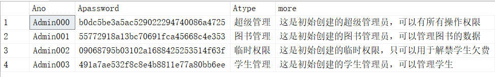

上述功能在`data_user.py`的`initAdmin`函数实现


然后随机生成一些学生和老师（借阅者）：

* 姓名是利用网上的起名器，都是三个字的，存在Sname文件里面
* id分老师学生，是递增输入
* 老师学生是随机设定的，用于后续不同权限
* 备注暂时置空，被禁用设置为0（没有被禁）
* 功能在函数`randUser(n)`实现
* 在插入借阅者数据的同时，为用户数据操作记录表添加记录【同时对两个表进行操作】

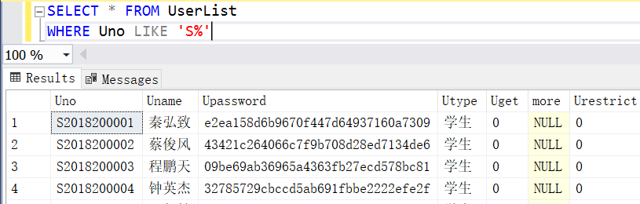


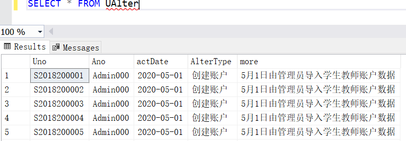


再生成一批图书：

* 此处由于图书要比较高的真实性，所以采用豆瓣的数据
* 先手动从豆瓣摘取一些数据，存储在本地
* 然后将图书数据插入数据库
* 插入的同时留存图书入库记录【同时插入两表】

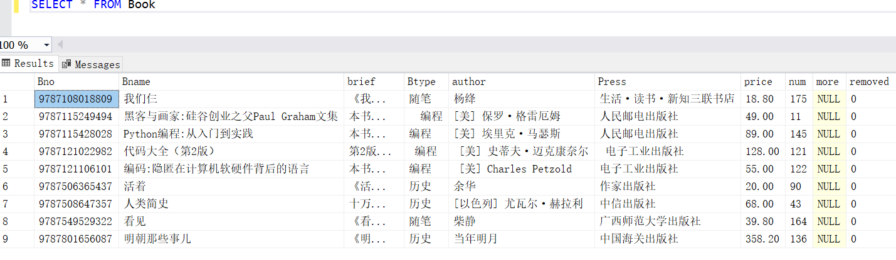

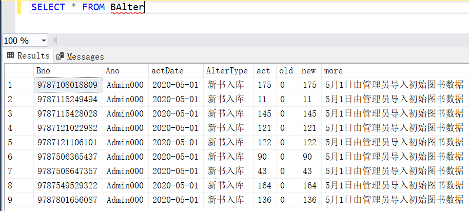

### 功能测试


## 总结

1基础

- [x] 使用基础数据集，建库建表插入基础数据
- [ ] 固定参数(直接在代码里写死)，对数据库进行汇总统计，用html table显示结果demo
- [ ] 固定参数(直接在代码里写死)，对数据库进行汇总统计，用柱状图或者饼图显示结果demo1

2进阶

- [x] 允许用户输入参数，对数据库进行汇总统计，用html table显示结果【图书信息查询】
- [ ] 允许用户输入参数，对数据库进行汇总统计，用柱状图或者饼图显示结果

3高级

- [x] 使用基础数据集、可以增删改基础数据集【在管理员部分可以进行增删改】
- [ ] 网站包括home,insert,delete,upate,query（对数据库进行汇总统计）等完整的功能

4加分项

- [ ] 图和table同时显示在一个网页上
- [ ] 如果能够实现1:n的两个表格数据的输入
- [ ] 数据模型构建完整
- [ ] 功能模型构建完整

5我的项目特色

- 基于Boostrap美化了前端的呈现效果，支持不同浏览器以及缩放。
- 提供了基于session的用户登录认证，并且对于没有登录的情况重定向到登录页面


## 参考文献和资料

虚拟环境的配置：

* https://blog.csdn.net/guying4875/article/details/80905472
* https://blog.csdn.net/happy_bigqiang/article/details/51168614?utm_medium=distribute.pc_relevant.none-task-blog-baidujs-4
* https://blog.csdn.net/Growing_hacker/article/details/89518534

boostrap参考：

* https://how2j.cn/k/boostrap/boostrap-setup/539.html如何使用boostrap（不涉及flask）
* https://v4.bootcss.com/docs/getting-started/download/ boostrap安装到本地
* https://www.layoutit.com/build 网页设计

flask整体教程：

* https://www.w3cschool.cn/flask/ W3教程
* https://blog.csdn.net/hanbo6/article/details/82563015；https://blog.csdn.net/wei18791957243/article/details/85237246用户登录功能的session方法

SQL server相关：

* https://docs.microsoft.com/zh-cn/sql/relational-databases/tables/create-foreign-key-relationships?view=sql-server-ver15
  创建外键关系

数据资源：

* https://www.qqxiuzi.cn/zh/xingming/姓名生成器
* 豆瓣读书

https://wenku.baidu.com/view/7c474d6491c69ec3d5bbfd0a79563c1ec4dad70d.html一份其他人的设计文档

